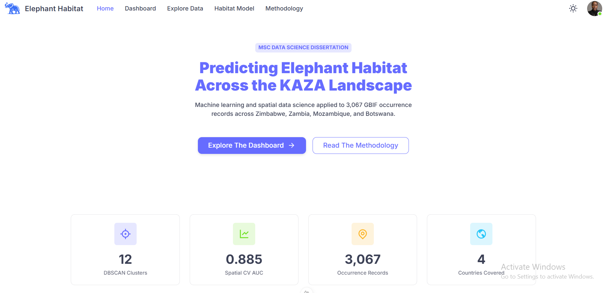
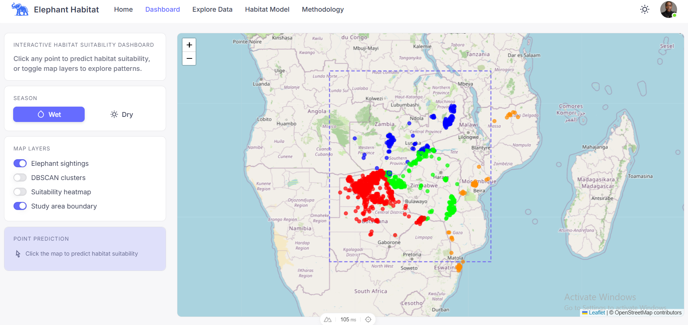
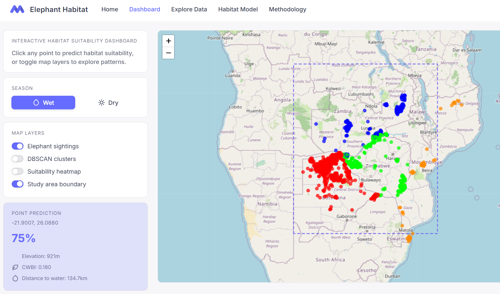
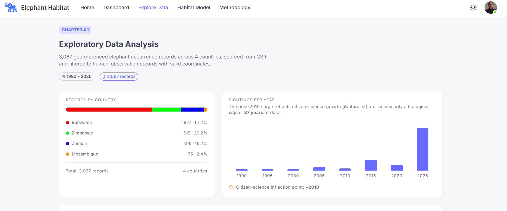
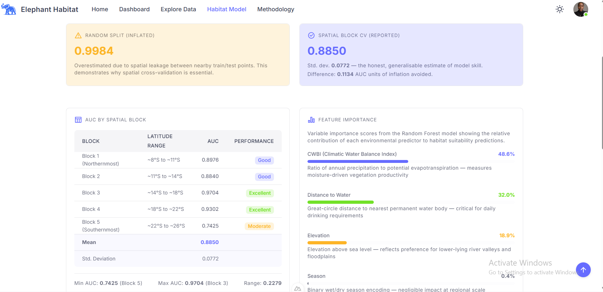

# 🐘 Elephant Habitat Suitability Dashboard

## Predicting Elephant Movement Patterns and Habitat Suitability in Southern Africa Using Machine Learning and Spatial Data Science

[](https://opensource.org/licenses/MIT)
[](https://www.python.org/downloads/)
[](https://nuxt.com/)
[](https://vuejs.org/)
[](https://fastapi.tiangolo.com/)
[](https://leafletjs.com/)

---

## 📋 Table of Contents

- [Overview](#-overview)
- [Research Context](#-research-context)
- [Key Findings](#-key-findings)
- [Project Structure](#-project-structure)
- [Features](#-features)
- [Technology Stack](#-technology-stack)
- [Installation & Setup](#-installation--setup)
- [Running the Application](#-running-the-application)
- [Data Sources](#-data-sources)
- [Model Performance](#-model-performance)
- [Screenshots](#-screenshots)
- [API Documentation](#-api-documentation)
- [Contributing](#-contributing)
- [License](#-license)
- [Author](#-author)
- [Acknowledgements](#-acknowledgements)
- [Citation](#-citation)

---

## 📖 Overview

This repository contains the complete source code and analysis pipeline for an MSc Data Science dissertation project applying machine learning and spatial data science techniques to predict African elephant (*Loxodonta africana*) habitat suitability across Southern Africa. The project processes 3,067 georeferenced occurrence records from the Global Biodiversity Information Facility (GBIF) across Zimbabwe, Zambia, Mozambique, and Botswana.

### What This Project Does

1. **Spatial Clustering** - Identifies elephant activity hotspots using DBSCAN clustering
2. **Habitat Suitability Modelling** - Predicts habitat quality using Random Forest with spatial block cross-validation
3. **Interactive Dashboard** - Visualises elephant distributions and allows real-time habitat suitability predictions
4. **Spatially-Rigorous Evaluation** - Implements spatial block cross-validation to avoid over-optimistic performance estimates

### Research Significance

- **Conservation Impact**: The KAZA Transfrontier Conservation Area contains **82.7%** of all clustered elephant sightings
- **Methodological Contribution**: Demonstrates that spatial block cross-validation reduces AUC inflation from **0.9984** (random split) to **0.8850** (spatial CV)
- **Open Science**: Entirely built on open-access data and freely available tools—reproducible and accessible for conservation research in the Global South

---

## 🌍 Research Context

### Study Area
The study encompasses four Southern African countries:
- **Botswana** (61.7% of records)
- **Zimbabwe** (20.9%)
- **Zambia** (16.2%)
- **Mozambique** (2.5%)

The region spans approximately **8°S to 26°S** and **20°E to 36°E**, covering the **Kavango-Zambezi Transfrontier Conservation Area (KAZA TFCA)**—the world's largest transboundary conservation area, home to an estimated **220,000 elephants**.

### Key Research Questions
1. Where are the primary elephant hotspots in Southern Africa?
2. What environmental factors most strongly predict habitat suitability?
3. How does spatial cross-validation affect model performance estimates?

---

## 🔑 Key Findings

| Metric | Value |
|--------|-------|
| **Total Records** | 3,067 |
| **DBSCAN Clusters** | 12 |
| **Clustered Records** | 3,041 (99.2%) |
| **Noise Points** | 26 (0.8%) |
| **KAZA Cluster Size** | 2,516 (82.7%) |
| **Spatial CV AUC (Mean)** | 0.8850 |
| **Spatial CV AUC (Std)** | 0.0772 |
| **Top Predictor** | CWBI (48.6%) |
| **Second Predictor** | Distance to Water (32.0%) |

### Environmental Predictor Importance
- **CWBI (Climatic Water Balance Index)**: 48.6%
- **Distance to Water**: 32.0%
- **Elevation**: 18.9%
- **Season**: 0.4%

> **Combined Importance**: CWBI + Distance to Water = **80.6%** of predictive power

---

## 📁 Project Structure

```
elephant-habitat/
├── README.md                           # This file
├── LICENSE                             # MIT License
├── .gitignore                          # Git ignore rules
├── docker-compose.yml                  # Docker orchestration (optional)
│
├── frontend/                           # Nuxt 3 / Vue 3 Frontend
│   ├── nuxt.config.ts                  # Nuxt configuration
│   ├── package.json                    # Frontend dependencies
│   ├── pages/                          # Application pages
│   │   ├── index.vue                   # Landing page
│   │   ├── dashboard.vue               # Interactive map dashboard
│   │   ├── explore.vue                 # EDA visualisations
│   │   ├── habitat-model.vue           # Model results & interpretation
│   │   └── methodology.vue             # Methodology & limitations
│   ├── components/                     # Reusable components
│   │   ├── map/                        # Map components
│   │   │   └── MapCanvas.vue           # Leaflet map wrapper
│   │   ├── charts/                     # Chart components
│   │   └── ui/                         # UI components
│   ├── composables/                    # Vue composables
│   │   ├── useSightingsData.ts         # Load sighting data
│   │   ├── usePredictApi.ts            # Prediction API calls
│   │   └── useCountryColors.ts         # Shared colour mapping
│   ├── assets/                         # Static assets
│   └── public/                         # Public files
│       └── data/                       # Static GeoJSON cache
│           ├── sightings.json          # Elephant sighting data
│           └── clusters.json           # DBSCAN cluster data
│
├── backend/                            # FastAPI Backend (Stage 3)
│   ├── app/
│   │   ├── main.py                     # FastAPI application
│   │   ├── api/                        # API endpoints
│   │   │   ├── predict.py              # POST /api/predict/point
│   │   │   ├── hotspots.py             # GET /api/hotspots
│   │   │   └── suitability.py          # GET /api/suitability-grid
│   │   ├── schemas.py                  # Pydantic models
│   │   └── core/                       # Core configuration
│   ├── requirements.txt                # Backend dependencies
│   └── Dockerfile                      # Backend Dockerfile
│
├── engine/                             # ML Pipeline (decoupled from API)
│   ├── inference.py                    # HabitatInferenceEngine class
│   ├── models/                         # Serialised ML models
│   │   ├── rf_final.pkl                # Random Forest model
│   │   ├── knn_elev.pkl                # KNN elevation interpolator
│   │   └── knn_ndvi.pkl                # KNN NDVI interpolator
│   ├── build_geojson_cache.py          # Generate static GeoJSON files
│   └── requirements.txt                # ML dependencies
│
├── notebooks/                          # Jupyter Notebooks (dissertation analysis)
│   └── 01_data_exploration.ipynb       # Full analysis pipeline
│
└── data/                               # Data files (.gitignored if large)
    ├── raw/
    │   └── 0000285-260507073636908.csv # GBIF occurrence data
    └── processed/
        └── elephant_final_dataset.csv  # Cleaned dataset with features
```

---

## ✨ Features

### 1. 🏠 Landing Page
- Hero section with project title and thesis statement
- Key statistics callouts (12 clusters, 0.885 AUC, 3,067 records, 4 countries)
- Clean, professional design to engage visitors

### 2. 📊 Interactive Dashboard
- **Full-screen Leaflet map** with interactive controls
- **Layer toggles** for:
    - Elephant sightings (colour-coded by country)
    - DBSCAN clusters (12 distinct colours)
    - Suitability heatmap (predicted habitat quality)
    - Study area boundary
- **Season toggle** (Wet/Dry) for contextual predictions
- **Click-to-predict** functionality:
    - Click anywhere on the map
    - Returns habitat suitability percentage
    - Displays environmental variables (elevation, CWBI, distance to water)

### 3. 📈 Exploratory Data Analysis
- Country breakdown with percentage distribution
- Sightings per year bar chart (1990–2026)
- Citizen science annotation (post-2010 iNaturalist surge)
- Interactive spatial distribution map (read-only)

### 4. 🧠 Habitat Model Page
- Model configuration details (200 trees, max depth 12)
- AUC comparison: Random split (0.9984) vs. Spatial CV (0.8850)
- Spatial block cross-validation results table
- Feature importance with ecological interpretation
- Conservation implications

### 5. 📚 Methodology Page
- Study area overview
- Data sources and acquisition details
- Analytical pipeline (two-stage approach)
- Spatial block cross-validation explanation
- Methodological refinements timeline
- Limitations (from Chapter 5.3)
- Conservation implications
- Downloads section

---

## 🛠 Technology Stack

### Frontend
| Technology | Version | Purpose |
|------------|---------|---------|
| **Nuxt 3** | 3.12+ | Vue.js framework for SSR/SSG |
| **Vue 3** | 3.4+ | Progressive JavaScript framework |
| **Vuetify** | 3.5+ | Material Design component library |
| **Leaflet** | 1.9+ | Interactive maps |
| **TypeScript** | 5.3+ | Type-safe JavaScript |

### Backend (Stage 3 - Planned)
| Technology | Version | Purpose |
|------------|---------|---------|
| **FastAPI** | 0.115+ | High-performance Python API |
| **Pydantic** | 2.5+ | Data validation |
| **Uvicorn** | 0.27+ | ASGI server |

### Machine Learning Pipeline
| Technology | Version | Purpose |
|------------|---------|---------|
| **Python** | 3.13+ | Primary language |
| **scikit-learn** | 1.8+ | ML algorithms (Random Forest, DBSCAN, KNN) |
| **Pandas** | 3.0+ | Data manipulation |
| **NumPy** | 2.4+ | Numerical computing |
| **Matplotlib** | 3.10+ | Visualisation |
| **Folium** | 0.20+ | Interactive maps |
| **Geopandas** | 1.1+ | Spatial operations |
| **Joblib** | 1.4+ | Model serialisation |

### Data APIs
| API | Purpose |
|-----|---------|
| **GBIF** | Elephant occurrence data |
| **Open-Elevation** | SRTM elevation data |
| **Open-Meteo** | Climate data (CWBI calculation) |

---

## 📥 Installation & Setup

### Prerequisites

- **Node.js** (v18+) and **npm** (v9+) for frontend
- **Python** (v3.13+) for ML pipeline
- **Git** for version control
- (Optional) **Docker** for containerisation

### Clone the Repository

```bash
git clone https://github.com/PinkLemo/elephant-habitat.git
cd elephant-habitat
```

### Frontend Setup

```bash
# Navigate to frontend directory
cd frontend

# Install dependencies
npm install

# Set up environment variables
cp .env.example .env
```

### Data Setup (Required for Map Visualisation)

#### Option 1: Generate Data from Notebook

```bash
# Navigate to notebooks directory
cd ../notebooks

# Install Python dependencies
pip install -r requirements.txt

# Run the notebook to generate data files
# Open 01_data_exploration.ipynb in Jupyter/VS Code
# Execute all cells - this will generate:
# - frontend/public/data/sightings.json
# - frontend/public/data/clusters.json
# - elephant_final_dataset.csv
```

#### Option 2: Download Pre-generated Data

```bash
# Create data directory
mkdir -p frontend/public/data

# Download sightings.json (example - replace with actual URLs)
curl -o frontend/public/data/sightings.json https://example.com/sightings.json
curl -o frontend/public/data/clusters.json https://example.com/clusters.json
```

### Backend Setup (Optional - Stage 3)

```bash
# Navigate to backend directory
cd ../backend

# Create virtual environment
python -m venv venv
source venv/bin/activate  # On Windows: venv\Scripts\activate

# Install dependencies
pip install -r requirements.txt
```

---

## 🚀 Running the Application

### Frontend Only (Development)

```bash
cd frontend
npm run dev
```

The application will be available at: **http://localhost:3000**

### Frontend Only (Production Build)

```bash
cd frontend
npm run build
npm run preview
```

### Full Stack (Frontend + Backend) - Stage 3

#### Using Docker Compose (Recommended)

```bash
docker-compose up -d
```

- Frontend: **http://localhost:3000**
- Backend API: **http://localhost:8000**
- API Docs: **http://localhost:8000/docs**

#### Manual Start

```bash
# Terminal 1: Backend
cd backend
uvicorn app.main:app --reload --port 8000

# Terminal 2: Frontend
cd frontend
npm run dev
```

---

## 📊 Data Sources

### 1. Elephant Occurrence Data
- **Source**: [GBIF (Global Biodiversity Information Facility)](https://www.gbif.org)
- **Dataset**: *Loxodonta africana* occurrence records
- **Download DOI**: [10.15468/dl.m6tfe3](https://doi.org/10.15468/dl.m6tfe3)
- **Records**: 3,067 (filtered)
- **Date Range**: 1968–2026
- **Filtering**:
    - Human observations only
    - Valid geographic coordinates
    - Geographic extent: Zimbabwe, Zambia, Mozambique, Botswana

### 2. Elevation Data
- **Source**: [Open-Elevation API](https://open-elevation.com)
- **Base Data**: SRTM 30m Digital Elevation Model
- **Imputation**: 3.3% median-imputed

### 3. Climatic Water Balance Index (CWBI)
- **Source**: [Open-Meteo API](https://open-meteo.com)
- **Definition**: Precipitation / Potential Evapotranspiration
- **Imputation**: 36.0% median-imputed

### 4. Distance to Water
- **Method**: Haversine formula
- **Water Features**:
    - Okavango Delta
    - Zambezi River
    - Lake Kariba
    - Okavango River
    - Limpopo River
    - Kafue River
    - Botswana Limpopo corridor

---

## 📈 Model Performance

### Spatial Block Cross-Validation Results

| Block | Latitude Range | AUC Score | Performance |
|-------|---------------|-----------|-------------|
| Block 1 (Northernmost) | ~8°S to ~11°S | 0.8976 | Excellent |
| Block 2 | ~11°S to ~14°S | 0.8840 | Good |
| Block 3 | ~14°S to ~18°S | 0.9704 | Excellent |
| Block 4 | ~18°S to ~22°S | 0.9302 | Excellent |
| Block 5 (Southernmost) | ~22°S to ~26°S | 0.7425 | Moderate |

**Summary Statistics:**
- **Mean AUC**: 0.8850
- **Standard Deviation**: 0.0772
- **Min AUC**: 0.7425 (Block 5)
- **Max AUC**: 0.9704 (Block 3)

### Comparison: Random Split vs Spatial CV

| Evaluation Method | AUC | Interpretation |
|-------------------|-----|----------------|
| Random Split | 0.9984 | **Inflated** (spatial autocorrelation) |
| Spatial Block CV | 0.8850 | **Honest** (generalisable) |

**Difference**: 0.1134 AUC units of inflation avoided

---

##  🖼️ Screenshots

### Landing Page


### Interactive Dashboard



### Exploratory Data Analysis


### Habitat Model


### Methodology


---

## 📚 API Documentation

### GET /api/hotspots
Returns DBSCAN cluster data as GeoJSON.

**Response:**
```json
{
  "type": "FeatureCollection",
  "features": [
    {
      "type": "Feature",
      "geometry": {
        "type": "Point",
        "coordinates": [24.5, -18.3]
      },
      "properties": {
        "cluster_id": 0,
        "count": 2516,
        "country": "Botswana"
      }
    }
  ]
}
```

### GET /api/suitability-grid
Returns the 100×100 habitat suitability grid.

**Response:**
```json
{
  "grid": [
    {
      "lat": -8.0,
      "lon": 20.0,
      "suitability": 0.85,
      "elevation": 450,
      "cwbi": 0.48,
      "dist_to_water": 12.5
    }
  ]
}
```

### POST /api/predict/point
Predicts habitat suitability for a specific point.

**Request:**
```json
{
  "lat": -18.5,
  "lon": 30.2,
  "season": "wet"
}
```

**Response:**
```json
{
  "suitability": 0.88,
  "elevation": 320.5,
  "cwbi": 0.425,
  "dist_to_water_km": 8.3,
  "season": "wet"
}
```

---

## 🤝 Contributing

### How to Contribute

1. **Fork the repository**
2. **Create a feature branch**
   ```bash
   git checkout -b feature/amazing-feature
   ```
3. **Commit your changes**
   ```bash
   git commit -m 'Add amazing feature'
   ```
4. **Push to the branch**
   ```bash
   git push origin feature/amazing-feature
   ```
5. **Open a Pull Request**

### Development Guidelines

- **Frontend**: Follow Vue 3 Composition API best practices
- **Python**: Follow PEP 8 style guide
- **Commits**: Use conventional commit messages
- **Documentation**: Update README and code comments

---

## 📄 License

This project is licensed under the **MIT License** - see the [LICENSE](LICENSE) file for details.

---

## 👤 Author

### Daliso Rumbi Miti
**MSc Data Science** | University of East London

- **Portfolio**: [my-portfolio-vue-steel.vercel.app](https://my-portfolio-vue-steel.vercel.app/)
- **GitHub**: [@PinkLemo](https://github.com/PinkLemo)
- **LinkedIn**: [Daliso Miti](https://www.linkedin.com/in/daliso-miti-805b8323a/)
- **Email**: dalisomiti@gmail.com

---

## 🙏 Acknowledgements

### Academic Supervisor
- **Dr. Mamas Louca** — University of East London

### Data Providers
- **GBIF** — Global Biodiversity Information Facility
- **Open-Elevation API** — SRTM elevation data
- **Open-Meteo API** — Climate data

### Inspiration
To my grandfather, who sat with me watching NatGeo Wild and Animal Planet, and quietly watered a love for animals that never left me.

### Project Resources
- [Leaflet Documentation](https://leafletjs.com/)
- [Vuetify Documentation](https://vuetifyjs.com/)
- [Scikit-learn Documentation](https://scikit-learn.org/)
- [GBIF API Documentation](https://www.gbif.org/developer/summary)

---

## 📝 Citation

If you use this project in your research, please cite:

```bibtex
@MastersThesis{Miti2026ElephantHabitat,
  author = {Miti, Daliso Rumbi},
  title = {Predicting Elephant Movement Patterns and Habitat Suitability in Southern Africa Using Machine Learning and Spatial Data Science},
  school = {University of East London},
  year = {2026},
  type = {MSc Dissertation},
  url = {https://github.com/PinkLemo/elephant-habitat}
}
```

---

## 📦 Quick Start Commands

```bash
# Clone repository
git clone https://github.com/PinkLemo/elephant-habitat.git
cd elephant-habitat

# Setup frontend
cd frontend
npm install
npm run dev

# Setup backend (optional)
cd ../backend
python -m venv venv
source venv/bin/activate  # Windows: venv\Scripts\activate
pip install -r requirements.txt
uvicorn app.main:app --reload

# Generate data from notebook
cd ../notebooks
pip install -r requirements.txt
jupyter notebook 01_data_exploration.ipynb
# Execute all cells to generate data files
```

---

## 🌟 Star the Project

If you find this project useful, please consider giving it a ⭐ on GitHub!

---

**Built with ❤️ for elephant conservation and open science**
